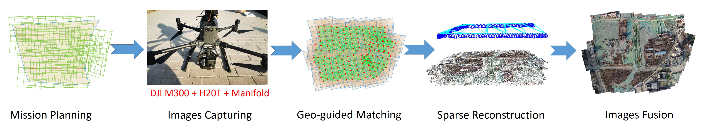

# HighStitch: High Altitude Georeferenced Aerial Images Stitching for Rocking Telephoto Lens




Code for [paper](https://ieeexplore.ieee.org/stamp/stamp.jsp?arnumber=9599576):

```
@article{zhao2021highstitch,
  title={HighStitch: High Altitude Georeferenced Aerial Images Stitching for Rocking Telephoto Lens},
  author={Zhao, Yong and Xu, Shibiao and Bu, Shuhui and Jiang, Hongkai and Han, Pengcheng},
  journal={IEEE Journal of Selected Topics in Applied Earth Observations and Remote Sensing},
  volume={14},
  pages={11500--11507},
  year={2021},
  publisher={IEEE}
}
```

Video: [Youtube](https://youtu.be/s001INRoyaE) [Bilibili](https://www.bilibili.com/video/BV1334y1k7gS/)


## Usages:

**Only tested on Ubuntu 18.04.**

## Install

This project uses [Svar](https://github.com/zdzhaoyong/Svar) for multiple language support, please install it firstly.

```
pip3 install svar==0.2.2
```

Copy the svar module plugins to your path (optional, you can also change the LD_LIBRARY_PATH):

```
sudo cp ./svar_modules/* /usr/local/lib
```

Then please compile the c++ source code with cmake (optional, if you only use python, this is not required):

```
cd highstitch
mkdir build&&cd build
cmake ..&& sudo make install
```

## Tryout the stitching

Prepare the sample dataset:

```
git clone https://github.com/zdzhaoyong/highstitch-dataset
```

Add environment PATH:

```
export LD_LIBRARY_PATH=$LD_LIBRARY_PATH:$(pwd)/svar_modules
```

Call with compiled C++ binary:

```
highstitch -task ./highstitch-dataset/sample/task.json -out dom.png
```

Call with python interface:

```
python3 python/5_highstitch.py -task ./highstitch-dataset/sample/task.json -out dom.png
```

This source code is only for trial with the following limits:

1. does not provide georeference information
2. tile resolution is limited to level 18
3. source image resolution is limited to 1920*1440
4. up to support 200 images

If you wanna use the code for commercial usage, please contact the author zd5945@126.com .

## The NPU HighStitch Dataset

More sequences can be found at : https://github.com/zdzhaoyong/highstitch-dataset

If you wanna capture your own dataset, please see: [Capture_Own_Dataset](./doc/capture_own_dataset.md)

## Supports

This code is based on  <a href="https://arxiv.org/abs/1902.07995">GSLAM: A General SLAM Framework and Benchmark</a>:

```
@inproceedings{gslamICCV2019,
        title={GSLAM: A General SLAM Framework and Benchmark},
        author={Yong Zhao, Shibiao Xu, Shuhui Bu, Hongkai Jiang, Pengcheng Han},
        booktitle={Proceedings of the IEEE International Conference on Computer Vision},
        year={2019},
        organization={IEEE}
}
```

and [Svar: A Tiny C++ Header Brings Unified Interface for Multiple programming Languages](https://arxiv.org/abs/2108.08464)

```
@misc{zhao2021svar,
      title={Svar: A Tiny C++ Header Brings Unified Interface for Multiple programming Languages}, 
      author={Yong Zhao and Pengcheng Zhao and Shibiao Xu and Lin Chen and Pengcheng Han and Shuhui Bu and Hongkai Jiang},
      year={2021},
      eprint={2108.08464},
      archivePrefix={arXiv},
      primaryClass={cs.PL}
}
```


## License

As this project is based on Svar interface SDK without core algorithm, you are free to distribute and modify it.

