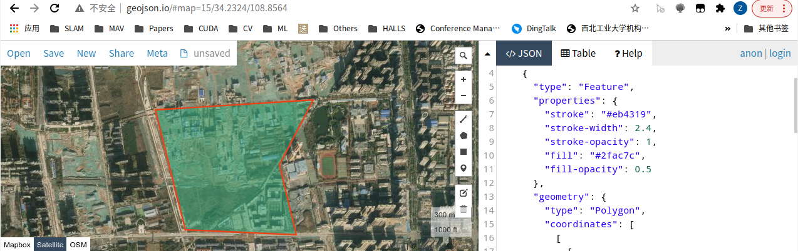
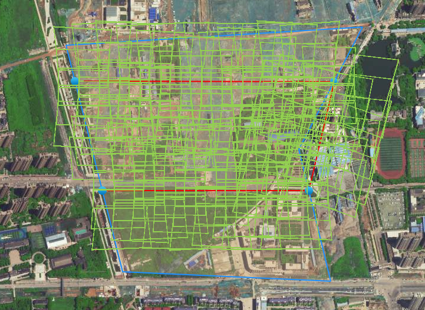
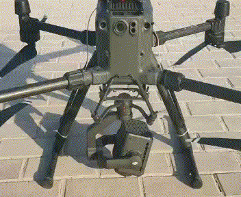
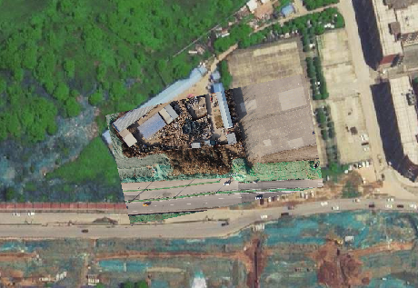
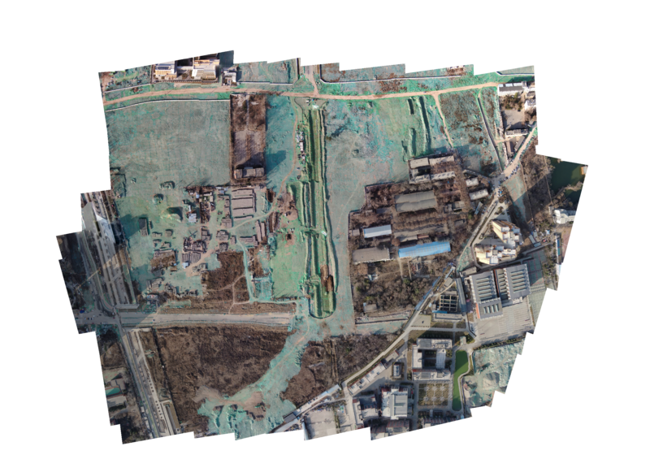

## How to capture your own dataset

We provide some python scripts for mission planning, simulation and dataset capturing. The capturing is now only developed for DJI M300 drones with H20t payload and OSDK support.

Firstly, select a mission area in website:  http://geojson.io/ .



Copy the JSON content to file [area.json](./python/area.json). A mission simulation can be visualized and planned with script, the camera parameters should corresponding to the zoom level:

```
cd python
python3 ./1_mission_simulation -area area.json -height 300 -v_max 15 -kml mission.kml -cam '[1920,1440,3350.778698,3350.778698,960,720]'
```



Run [2_rtmv_capture.py](./python/2_rtmv_capture.py) on Manifold 2C, the gimbal should rock like the following gif:

```
python3 python/2_rtmv_capture.py -height 300 -v_max 15 -cam '[1920,1440,3350.778698,3350.778698,960,720]'
```



Import the mission to your remote and fly, a rtmv file will be captured in your folder, now you can visualize it in the mapwidget:

```
python3 python/3_rtmv_play.py -rtmv data/sample.rtmv -cam '[1920,1440,3350.778698,3350.778698,960,720]'
```



Generate a task from the captured rtmv file:

```
python3 python/4_task_generation.py -rtmv data/sample.rtmv -task data/sample -height 300 -v_max 15 -cam '[1920,1440,3350.778698,3350.778698,960,720]'
```

Stitch the task to orthophoto:

```
python3 python/5_highstitch.py -task ./data/sample/task.json -out dom.png
```

The ortho should looks like this:

